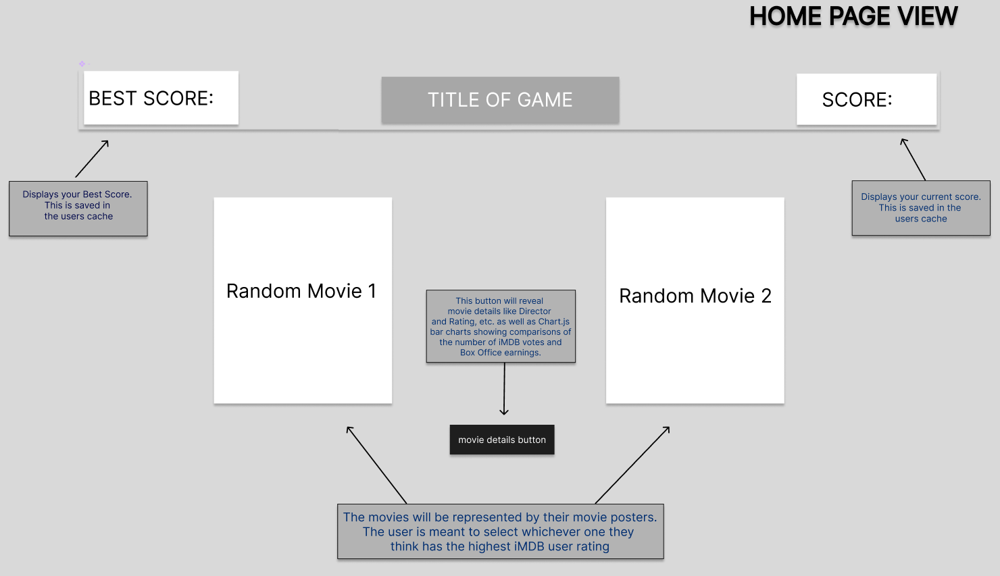
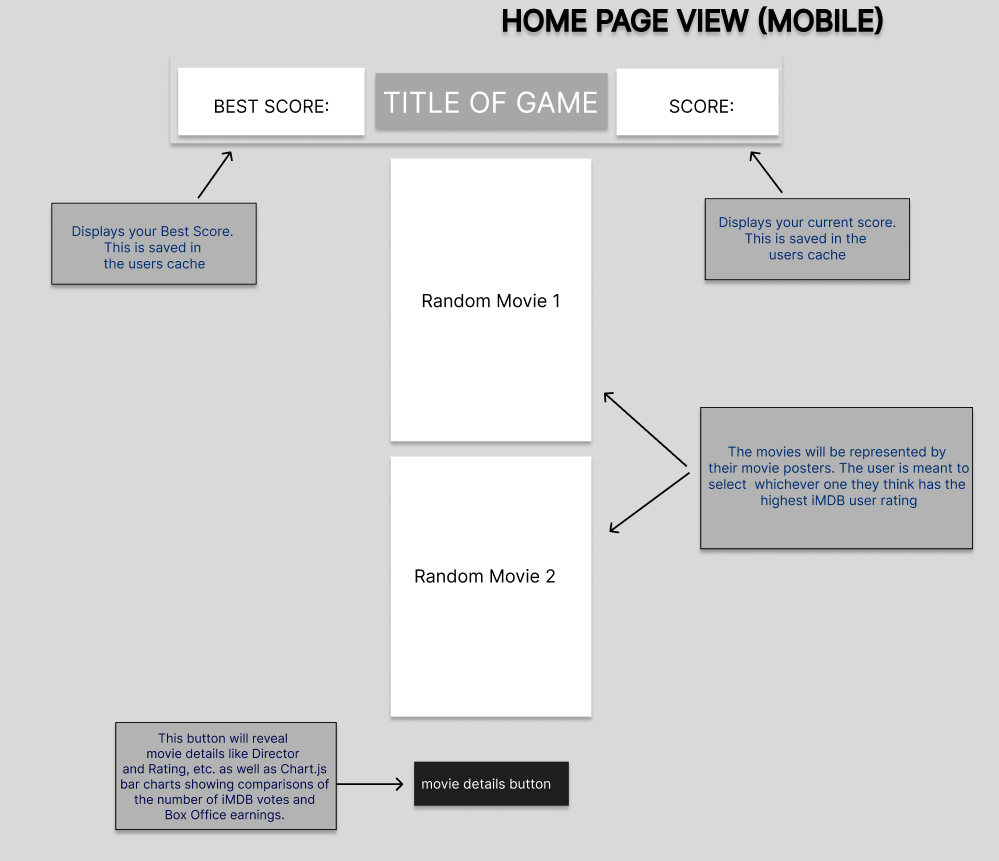
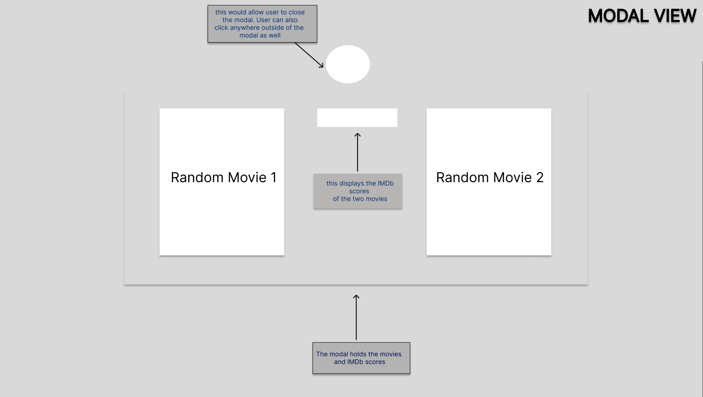
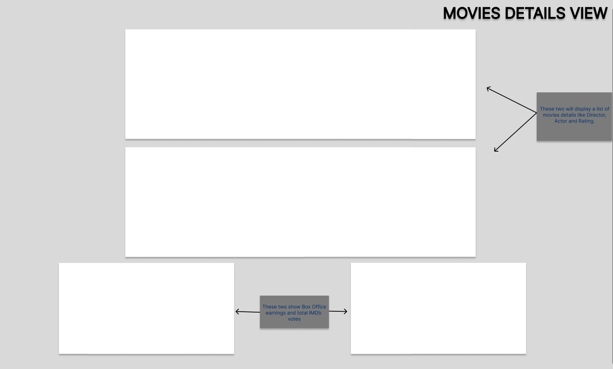

# Fighting Frames

Made using The Open Movie Database (OMDB API), this web game asks you to select the highest user rating between two movies on IMDb.

This is deployed using Netlify to hide my API Key which gave me the opportunity to share it with my mom.
 
https://ff.mweatherford.rocks/
 
 

# How To Run

This project runs out of the box with Live Server installed. If you do not have Live Server, it can be installed by navigating to VS Code Extentions. You can also see it in action by clicking the link above. Have fun!!!

# Wire Frame

 

 

 

 
